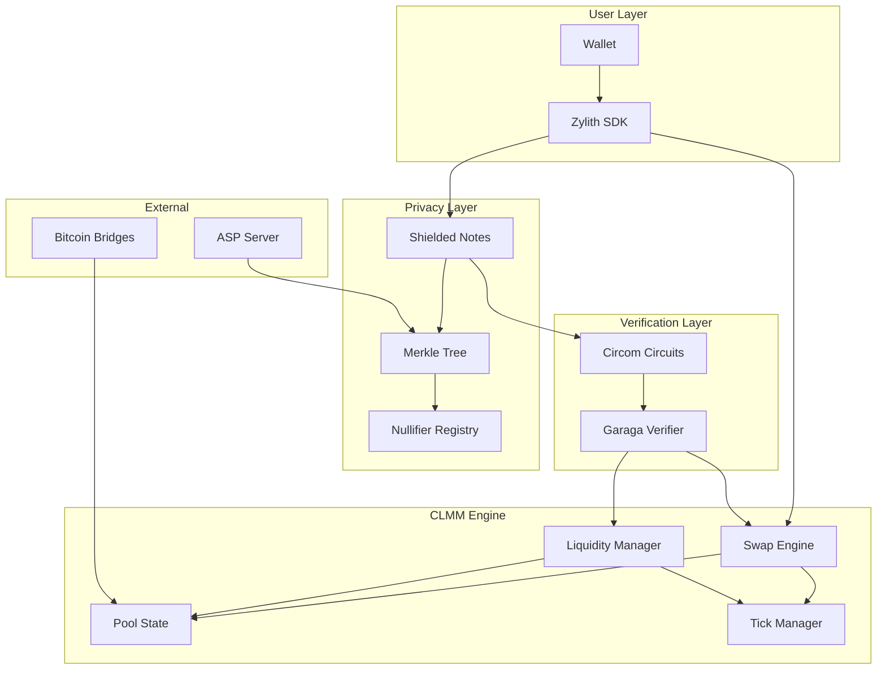

<p align="center">
  
</p>

<h1 align="center">Zylith</h1>

<p align="center">
  <strong>Shielded Concentrated Liquidity Market Maker for Bitcoin on Starknet</strong>
</p>

<p align="center">
  <a href="#"></a>
  <a href="#"></a>
  <a href="#"></a>
  <a href="https://dorahacks.io/hackathon/redefine"></a>
</p>

<p align="center">
  <a href="#overview">Overview</a> •
  <a href="#key-features">Features</a> •
  <a href="#architecture">Architecture</a> •
  <a href="#getting-started">Getting Started</a> •
  <a href="#documentation">Docs</a>
</p>

---

## Overview

**Zylith** is a shielded Concentrated Liquidity Market Maker (CLMM) built for Bitcoin DeFi on Starknet. It combines the capital efficiency of concentrated liquidity (inspired by Ekubo) with privacy-preserving technology using zero-knowledge proofs.

### Why Zylith?

| Traditional AMM | Zylith |
|-----------------|--------|
| Public positions | Shielded positions via commitments |
| Visible swap amounts | Private swap verification |
| Address-linked LP | Commitment-based LP ownership |
| Limited to ERC20 | Native Bitcoin support (tBTC, WBTC, LBTC) |

> Built for the [RE{DEFINE} Hackathon](https://dorahacks.io/hackathon/redefine) - Starknet's Bitcoin & Privacy Hackathon 2026

---

## Key Features

### Privacy Layer
- **Shielded Notes**: Commitments using `Poseidon(Poseidon(secret, nullifier), amount)`
- **Merkle Tree**: On-chain commitment storage with historical root tracking
- **Nullifier Registry**: Double-spend prevention
- **ZK Verification**: Groth16 proofs via Garaga

### CLMM Engine
- **Concentrated Liquidity**: Ekubo-style 128.128 sqrt price math
- **Tick Management**: Bitmap-based tick navigation
- **Fee Accounting**: Protocol fees with withdrawal-fee on burns
- **Precise Arithmetic**: u128 liquidity/fee calculations

### Bitcoin Integration
- **Multi-Token Support**: tBTC, WBTC, LBTC
- **Bridge Agnostic**: Compatible with Garden Finance, StarkGate
- **BTC-Native Pools**: First-class Bitcoin trading pairs

---

## Architecture



### System Flow

```
┌─────────────────────────────────────────────────────────────────┐
│                        PRIVATE SWAP FLOW                        │
├─────────────────────────────────────────────────────────────────┤
│                                                                 │
│  1. User creates commitment: C = H(H(secret, nullifier), amt)   │
│                              │                                  │
│  2. Deposit tokens ──────────┼──► Commitment added to Merkle    │
│                              │                                  │
│  3. Generate ZK proof:       │                                  │
│     • Membership proof       │                                  │
│     • Nullifier uniqueness   │                                  │
│     • Swap math correctness  │                                  │
│                              │                                  │
│  4. Submit to Zylith ────────┼──► Garaga verifies proof         │
│                              │                                  │
│  5. CLMM executes swap ──────┼──► New commitment created        │
│                              │                                  │
│  6. Nullifier recorded ──────┴──► Prevents double-spend         │
│                                                                 │
└─────────────────────────────────────────────────────────────────┘
```

---

## Technical Stack

### Core Development

| Tool | Version | Purpose |
|------|---------|---------|
| [Cairo](https://www.cairo-lang.org/) | 2.13.1+ | Smart contract language |
| [Scarb](https://docs.swmansion.com/scarb/) | 2.13.1+ | Package manager & build tool |
| [Starknet Foundry](https://github.com/foundry-rs/starknet-foundry) | 0.51.1+ | Testing framework |
| [Starkli](https://github.com/xJonathanLEI/starkli) | Latest | CLI for Starknet |

### ZK/Privacy Stack

| Tool | Version | Purpose |
|------|---------|---------|
| [Garaga](https://github.com/keep-starknet-strange/garaga) | Latest | Groth16 verification on Starknet |
| [Circom](https://docs.circom.io/) | 2.x | ZK circuit development |
| [snarkjs](https://github.com/iden3/snarkjs) | Latest | Proof generation |
| Python | 3.10 | Garaga SDK requirement |

### Libraries

| Library | Version | Purpose |
|---------|---------|---------|
| [OpenZeppelin Cairo](https://github.com/OpenZeppelin/cairo-contracts) | 1.0.0 | ERC20, security patterns |
| [Alexandria](https://github.com/keep-starknet-strange/alexandria) | 0.9.0 | Math utilities |

---

## Getting Started

### Prerequisites

- Unix-based OS (Linux/macOS)
- Git
- Python 3.10
- Rust (for ASP server)
- Node.js 18+ (for Circom/snarkjs)

### Installation

1. **Install Starknet development tools**
```bash
curl --proto '=https' --tlsv1.2 -sSf https://sh.starkup.sh | sh
```

2. **Clone the repository**
```bash
git clone https://github.com/salazarsebas/Zylith.git
cd Zylith
```

3. **Install dependencies**
```bash
scarb build
```

4. **Install Garaga**
```bash
pip install garaga
```

5. **Install Circom**
```bash
npm install -g circom snarkjs
```

### Quick Start

```bash
# Build contracts
scarb build

# Run tests
scarb test

# Format code
scarb fmt
```

---

## Project Structure

```
zylith/
├── src/
│   ├── clmm/
│   │   ├── math/
│   │   │   ├── sqrt_price.cairo      # 128.128 sqrt price math
│   │   │   ├── tick_math.cairo       # Tick calculations
│   │   │   └── liquidity.cairo       # Liquidity math
│   │   ├── pool.cairo                # Pool state management
│   │   ├── swap.cairo                # Swap engine
│   │   ├── positions.cairo           # LP position management
│   │   ├── tick_bitmap.cairo         # Tick bitmap operations
│   │   └── fees.cairo                # Fee accounting
│   │
│   ├── privacy/
│   │   ├── notes.cairo               # Shielded note structures
│   │   ├── merkle.cairo              # Merkle tree component
│   │   ├── nullifier.cairo           # Nullifier registry
│   │   └── commitment.cairo          # Commitment utilities
│   │
│   ├── verifier/
│   │   ├── types.cairo               # Proof and public input types
│   │   ├── membership_verifier.cairo # Membership proof verifier
│   │   ├── swap_verifier.cairo       # Swap proof verifier
│   │   ├── mint_verifier.cairo       # LP mint proof verifier
│   │   ├── burn_verifier.cairo       # LP burn proof verifier
│   │   └── coordinator.cairo         # Central verification coordinator
│   │
│   ├── interfaces/
│   │   ├── pool.cairo                # IZylithPool
│   │   ├── erc20.cairo               # IERC20
│   │   ├── verifier.cairo            # IVerifier trait
│   │   └── coordinator.cairo         # IVerifierCoordinator trait
│   │
│   └── lib.cairo                     # Library exports
│
├── circuits/
│   ├── membership.circom             # Merkle membership proof
│   ├── swap.circom                   # Private swap verification
│   ├── liquidity.circom              # LP templates (PrivateMint, PrivateBurn)
│   ├── mint.circom                   # PrivateMint entry point
│   ├── burn.circom                   # PrivateBurn entry point
│   ├── common/
│   │   ├── commitment.circom         # Zylith commitment scheme
│   │   ├── poseidon.circom           # Poseidon hash
│   │   └── merkle.circom             # Merkle proof helper
│   └── scripts/
│       ├── compile_circuits.sh       # Circom compilation
│       ├── setup.sh                  # Trusted setup
│       └── generate_verifiers.sh     # Garaga verifier generation
│
├── asp/
│   ├── src/
│   │   ├── main.rs                   # ASP server entry
│   │   ├── merkle.rs                 # Merkle tree replica
│   │   └── api.rs                    # REST API endpoints
│   └── Cargo.toml
│
├── tests/
│   ├── test_swap.cairo
│   ├── test_liquidity.cairo
│   ├── test_privacy.cairo
│   └── test_integration.cairo
│
├── scripts/
│   ├── deploy.sh                     # Deployment script
│   └── generate_verifier.sh          # Garaga verifier generation
│
├── assets/
│   └── Zylith.png                    # Logo
│
├── Scarb.toml                        # Cairo package config
└── README.md
```

---

## Core Components

### CLMM Engine

The CLMM layer implements concentrated liquidity mechanics inspired by Ekubo:

**Pool State**
```cairo
#[derive(Drop, Serde, starknet::Store)]
struct PoolState {
    sqrt_price: u256,        // 128.128 fixed point
    tick: i32,               // Current tick
    liquidity: u128,         // Active liquidity
    fee_growth_global_0: u256,
    fee_growth_global_1: u256,
    protocol_fees_0: u128,
    protocol_fees_1: u128,
}
```

**Tick Structure**
```cairo
#[derive(Drop, Serde, starknet::Store)]
struct TickInfo {
    liquidity_gross: u128,
    liquidity_net: i128,
    fee_growth_outside_0: u256,
    fee_growth_outside_1: u256,
    initialized: bool,
}
```

### Privacy Layer

**Commitment Structure**
```
commitment = Poseidon(
    Poseidon(secret, nullifier),
    amount
)
```

**Merkle Tree**
- Height: 25 (2^24 leaves)
- Hash: Poseidon
- Incremental updates
- Historical root storage (last N roots)

### Verifier Integration

Garaga-generated Groth16 verifier for:
- Membership proofs
- Swap transition proofs
- LP operation proofs

---

## Bitcoin Integration

### Supported Tokens

| Token | Bridge | Contract |
|-------|--------|----------|
| **tBTC** | [Threshold Network](https://threshold.network/) | TBD |
| **WBTC** | [StarkGate](https://starkgate.starknet.io/) | TBD |
| **LBTC** | [Lombard](https://www.lombard.finance/) | TBD |

### Creating a BTC Pool

```cairo
// Initialize a tBTC/USDC pool
fn create_btc_pool(
    tbtc_address: ContractAddress,
    usdc_address: ContractAddress,
    fee_tier: u32,
    initial_sqrt_price: u256
) -> ContractAddress;
```

### Bridging Bitcoin

1. **Via Garden Finance** (recommended for direct BTC)
   - Visit [garden.finance](https://garden.finance/)
   - Bridge BTC directly to Starknet

2. **Via StarkGate** (for WBTC holders)
   - Bridge WBTC from Ethereum
   - Mint native WBTC on Starknet

---

## Circuits

### Membership Circuit
```circom
template Membership(levels) {
    signal input root;
    signal input leaf;
    signal input pathElements[levels];
    signal input pathIndices[levels];

    // Verify Merkle path
    component hasher[levels];
    // ... implementation

    root === computedRoot;
}
```

### Swap Circuit
```circom
template PrivateSwap() {
    // Private inputs
    signal input secret;
    signal input nullifier;
    signal input amount_in;
    signal input pathElements[24];
    signal input pathIndices[24];

    // Public inputs
    signal input root;
    signal input nullifier_hash;
    signal input amount_out_commitment;
    signal input sqrt_price_after;

    // Verify note ownership
    component membership = Membership(24);

    // Verify swap math
    component swap = SwapMath();

    // Output new commitment
    // ...
}
```

---

## Testing

### Run All Tests
```bash
scarb test
```

### Run Specific Tests
```bash
snforge test test_swap
snforge test test_privacy --exact
```

### Coverage Report
```bash
snforge test --coverage
```

### Integration Tests
```bash
# Start local Starknet node
katana --accounts 3 --seed 0

# Run integration tests
snforge test --filter integration
```

---

## Deployment

### Testnet (Sepolia)

1. **Configure environment**
```bash
export STARKNET_RPC="https://starknet-sepolia.public.blastapi.io"
export STARKNET_ACCOUNT="~/.starkli-wallets/deployer/account.json"
export STARKNET_KEYSTORE="~/.starkli-wallets/deployer/keystore.json"
```

2. **Deploy contracts**
```bash
./scripts/deploy.sh testnet
```

### Mainnet

```bash
./scripts/deploy.sh mainnet
```

---

## Roadmap

### MVP (Hackathon - Feb 2026)
- [x] Project setup & architecture
- [x] CLMM core (swap, liquidity, fees)
- [x] Privacy layer (notes, Merkle tree, nullifiers)
- [x] Circom circuits (membership, swap, liquidity)
- [x] Garaga verifier integration
- [ ] ASP server
- [ ] Basic test coverage
- [ ] Testnet deployment

### Post-Hackathon
- [ ] Private multi-hop routing
- [ ] Private tick range selection
- [ ] Private limit orders
- [ ] Proof aggregation
- [ ] Full audit
- [ ] Mainnet launch

---

## Contributing

We welcome contributions! Please see our [Contributing Guide](CONTRIBUTING.md) for details.

```bash
# Fork and clone
git clone https://github.com/salazarsebas/Zylith.git

# Create branch
git checkout -b feature/your-feature

# Make changes and test
scarb test

# Format code
scarb fmt

# Submit PR
```

---

## Security

This project is under active development for a hackathon. **Do not use in production.**

Found a vulnerability? Please report it responsibly:
- Email: security@zylith.xyz
- Do not open public issues for security vulnerabilities

---

## License

This project is licensed under the MIT License - see the [LICENSE](LICENSE) file for details.

---

## Team

<table>
  <tr>
    <td align="center">
      <strong>Kevin Membreno</strong><br/>
      <sub>Core Developer</sub>
    </td>
    <td align="center">
      <strong>Josue Araya</strong><br/>
      <sub>Core Developer</sub>
    </td>
    <td align="center">
      <strong>Sebastian Salazar</strong><br/>
      <sub>Core Developer</sub>
    </td>
    <td align="center">
      <strong>Sandeep Chauhan</strong><br/>
      <sub>Core Developer</sub>
    </td>
  </tr>
</table>

---

## Acknowledgments

- [Starknet Foundation](https://www.starknet.io/) - For the RE{DEFINE} Hackathon
- [Ekubo Protocol](https://www.ekubo.org/) - CLMM reference implementation
- [Privacy Pools](https://docs.privacypools.com/) - Privacy architecture inspiration
- [Garaga](https://github.com/keep-starknet-strange/garaga) - ZK verification toolkit
- [OpenZeppelin](https://www.openzeppelin.com/) - Secure contract patterns

---

<p align="center">
  Built with STARK proofs on Starknet
</p>
