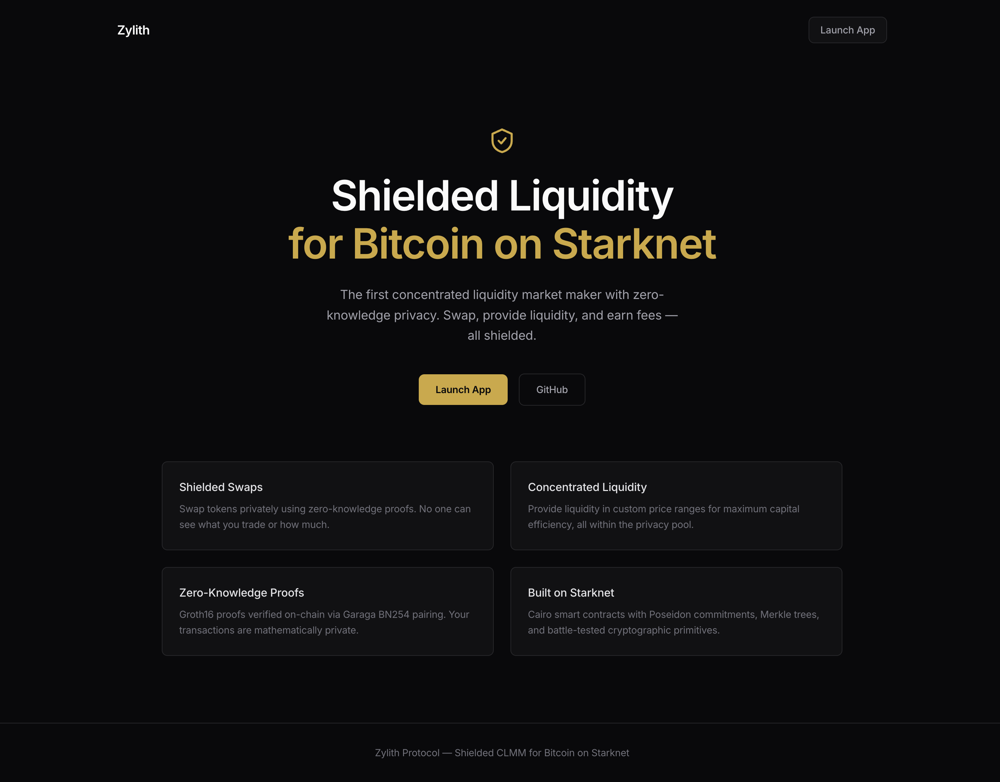
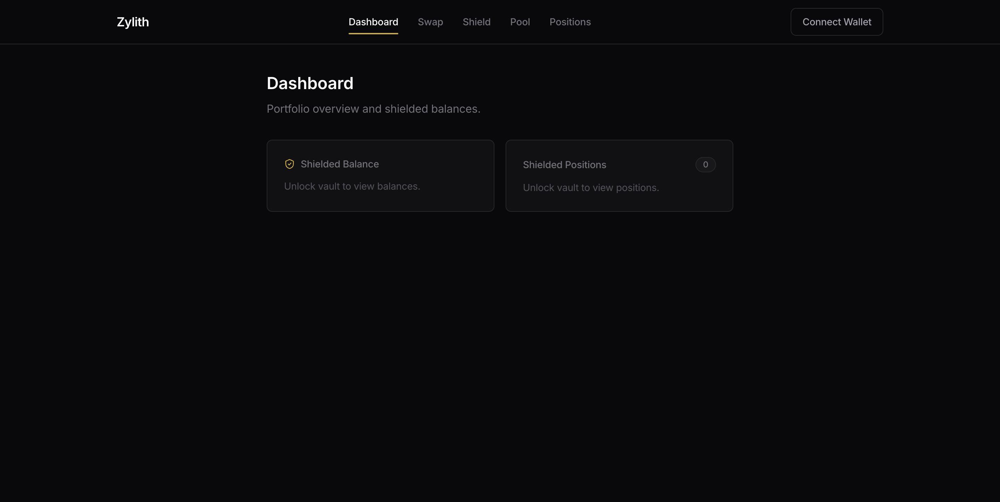
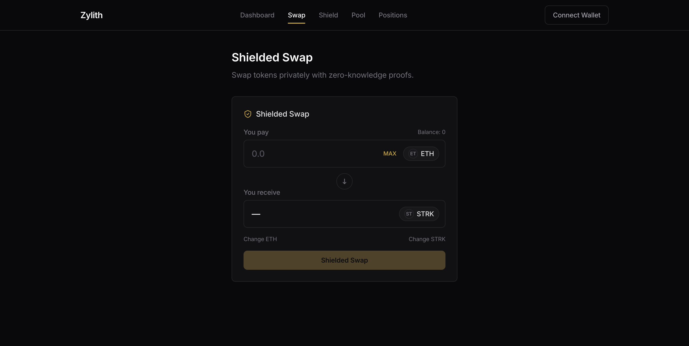
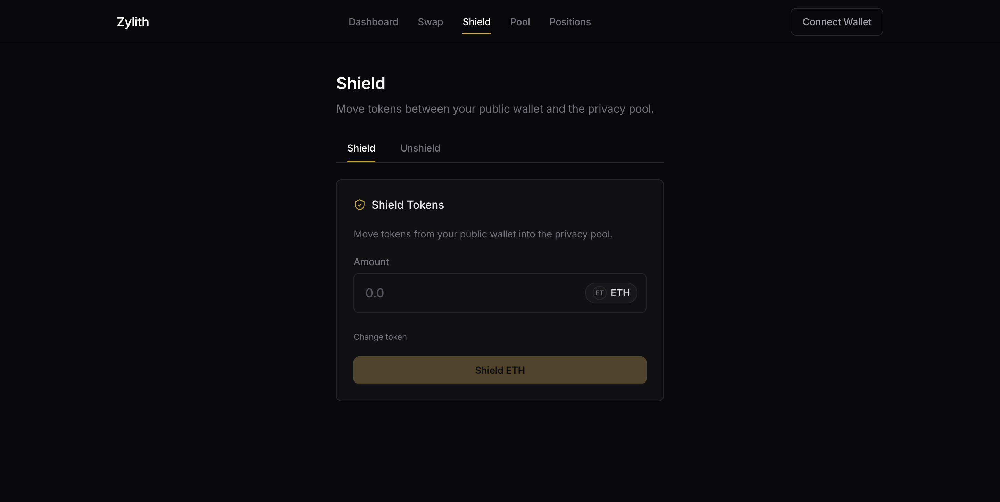
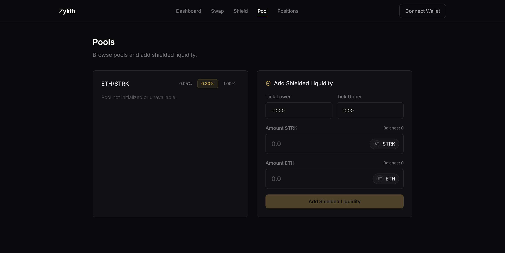
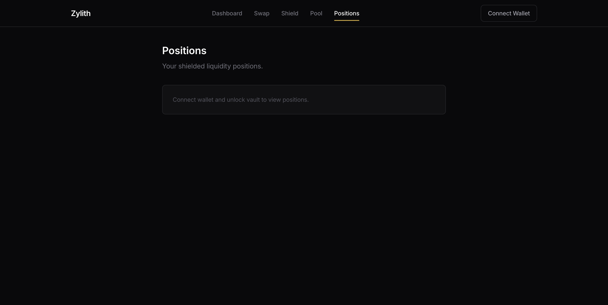
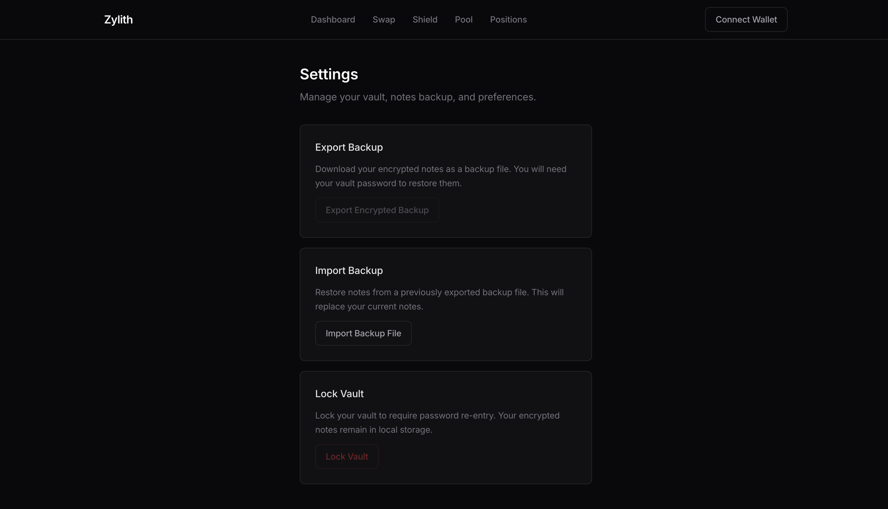

# Zylith Frontend

Web application for the Zylith protocol — a shielded concentrated liquidity market maker (CLMM) for Bitcoin on Starknet.

Built with the **Obsidian Core** design system: structured minimalism, brushed gold accents on deep black, zero unnecessary decoration.

## Screenshots

### Landing Page


### Dashboard


### Shielded Swap


### Shield / Unshield


### Pool & Add Liquidity


### Positions


### Settings


## Tech Stack

| Layer | Choice |
|-------|--------|
| Framework | Vite 6 + React 18 + TypeScript 5.7 |
| Styling | Tailwind CSS v4 (CSS-first `@theme` config) |
| Routing | react-router v7 |
| Server State | TanStack Query v5 (polling: 12s pools, 30s ASP) |
| Client State | Zustand v5 (wallet, SDK, UI stores) |
| Wallet | @starknet-react/core v3 (ArgentX + Braavos) |
| Animation | motion v11 |
| SDK | @zylith/sdk (workspace dependency) |

## Getting Started

### Prerequisites

- [Bun](https://bun.sh) v1.x
- The SDK must be built first (`cd ../sdk && bun run build`)

### Install & Run

```bash
# From the repo root
bun install

# Build the SDK (required once)
cd sdk && bun run build && cd ..

# Start the frontend dev server
cd frontend
cp .env.example .env.local   # Configure RPC URL and ASP URL
bun run dev                   # http://localhost:5173
```

### Production Build

```bash
bun run build    # Output in dist/
bun run preview  # Preview production build
```

## Environment Variables

| Variable | Description | Default |
|----------|-------------|---------|
| `VITE_STARKNET_RPC_URL` | Starknet RPC endpoint | `https://free-rpc.nethermind.io/sepolia-juno/` |
| `VITE_ASP_URL` | ASP server URL | `http://localhost:3000` |
| `VITE_CHAIN_ID` | Starknet chain ID | `SN_SEPOLIA` |

## Project Structure

```
frontend/
  src/
    main.tsx                  # Entry: providers + router
    App.tsx                   # Route definitions
    polyfills.ts              # Buffer/process for SDK deps
    config/                   # Env vars, token list, chains
    styles/                   # Tailwind @theme + Obsidian Core tokens
    stores/                   # Zustand: walletStore, sdkStore, uiStore
    hooks/                    # useDeposit, useSwap, useMint, useBurn, etc.
    lib/                      # Utilities (format, query keys, cn)
    components/
      ui/                     # 14 Obsidian Core primitives
      layout/                 # AppLayout, NavBar, PageContainer, AuthGuard
      features/               # Swap, Shield, Pool, Positions, Wallet, Shared
    pages/                    # 7 page components
    providers/                # Starknet, Query, Toast providers
  docs/screenshots/           # UI screenshots
```

## Design System: Obsidian Core

- **Palette**: 80% black (`#09090B`), 15% neutrals, 4% brushed gold (`#C9A94E`), 1% signal red
- **Gold**: Brushed metal tone, never bright `#FFD700`. Used for primary CTAs and active states.
- **Red**: Signal only (errors, destructive actions). Never decorative.
- **One primary CTA per screen**: Solid gold background + dark text.
- **No drop shadows, shiny gradients, or particle effects.**
- **Motion**: 150-250ms, ease-out entrance, ease-in exit.

See [`/docs/DESIGN_SYSTEM.md`](../docs/DESIGN_SYSTEM.md) for the full specification.
